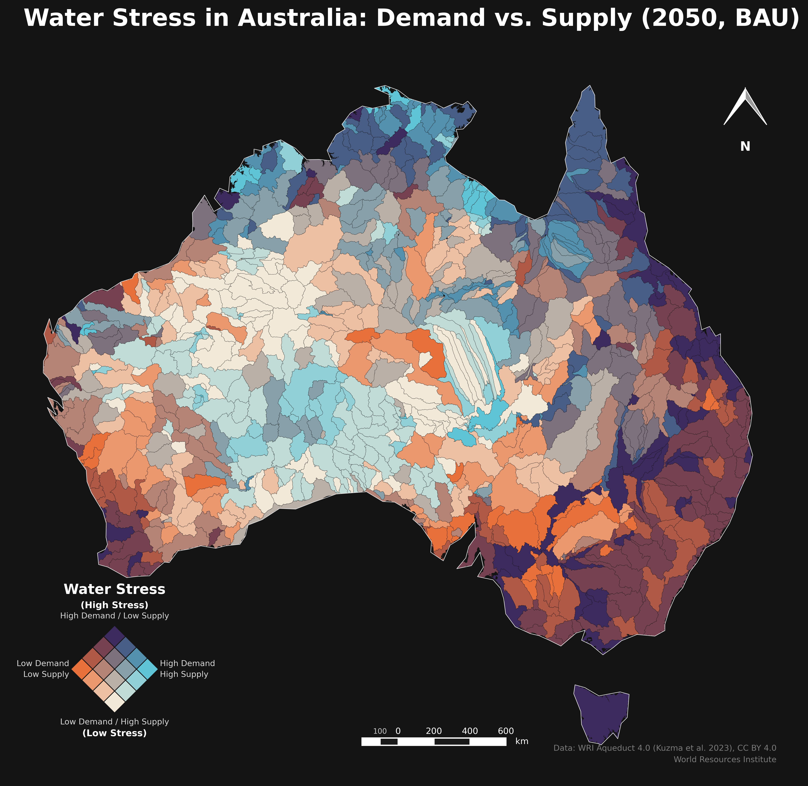

# Australia Water Stress Map — Demand vs. Supply (2050, BAU)

A bivariate choropleth map visualizing projected water stress across Australia's river basins, built entirely in Python.



## About This Project

Water stress isn't just about how much water exists — it's about **demand vs. supply**. A basin can have plentiful water and still be under severe stress if demand outpaces it, or conversely, low demand can offset naturally limited supply. This map captures that relationship using a 4×4 bivariate classification, where each basin is colored according to *both* its projected water demand and its projected water supply simultaneously.

## Credit

The original methodology and cartographic workflow for this map — reprojecting basin polygons, quartile-classifying demand and supply, building a 16-class bivariate color matrix, and hand-constructing a diamond legend — was developed by **Mashford Mahute** using QGIS. His original write-up walks through the process step by step for South America.

This repository takes that same methodology and **automates it end-to-end in Python**, so the full map — data loading, reprojection, classification, bivariate color generation, legend, north arrow, scale bar, and export — can be regenerated for any country or scenario by editing a handful of variables, rather than rebuilding the layout manually in a GUI each time.

## Data Source

**WRI Aqueduct 4.0** — Future Annual, Business-As-Usual (BAU) scenario, 2050 milestone (reflecting the 2035–2065 window)
Kuzma et al. (2023), CC BY 4.0, World Resources Institute
[https://www.wri.org/data/aqueduct-global-maps-40-data](https://www.wri.org/data/aqueduct-global-maps-40-data)

- **Demand field**: `bau50_ww_x_r`
- **Supply field**: `bau50_ba_x_r`
- Basin polygons at HydroSHEDS v1 level 6 resolution

## What the Pipeline Does

1. **Load** — Reads the Aqueduct File Geodatabase (`.gdb`) directly using `pyogrio`/`fiona`, no manual QGIS import needed
2. **Reproject & clip** — Projects basins to an equal-area CRS (GDA94 / Australian Albers, EPSG:3577) and clips to the Australian boundary
3. **Classify** — Quartile-bins demand and supply independently, then combines them into a single 16-class bivariate code
4. **Color** — Generates all 16 hex colors programmatically via bilinear interpolation across 4 corner colors, replacing the manual spreadsheet step
5. **Render** — Draws the map with a true rotated-diamond bivariate legend, a two-tone north arrow, and a cartographic double-bar scale, all as native `matplotlib` geometry
6. **Export** — Outputs a publication-ready, high-resolution JPG

## Tools & Libraries

- Python 3
- [geopandas](https://geopandas.org/) — spatial data handling
- [pyogrio](https://pyogrio.readthedocs.io/) / [fiona](https://fiona.readthedocs.io/) — File Geodatabase reading
- [matplotlib](https://matplotlib.org/) — rendering and cartographic elements
- [pandas](https://pandas.pydata.org/) / [numpy](https://numpy.org/) — classification and color math
- Jupyter Notebook

## Setup & Usage

```bash
# Clone the repository
git clone https://github.com/LipiKasera/Australia-Water-Stress-Map.git
cd australia-water-stress-map

# Install dependencies
pip install -r requirements.txt

# Download the WRI Aqueduct 4.0 data separately from:
# https://www.wri.org/data/aqueduct-global-maps-40-data
# (not included in this repo due to file size)

# Launch the notebook
jupyter notebook Australia_Water_Stress_Map.ipynb
```

Update the `gdb_path` variable in the first cell to point to wherever you've downloaded and extracted the Aqueduct geodatabase.

## Repository Contents

| File | Description |
|---|---|
| `Australia_Water_Stress_Map.ipynb` | Full Jupyter Notebook workflow, step by step |
| `Australia_Water_Stress_Map.jpg` | Final exported map |
| `requirements.txt` | Python package dependencies |

## License

Map design and code: feel free to reuse and adapt with attribution to this repository and to Mashford Mahute's original methodology.
Underlying data: CC BY 4.0, World Resources Institute — see [Aqueduct 4.0 terms](https://www.wri.org/data/aqueduct-global-maps-40-data)
